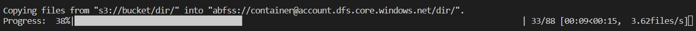
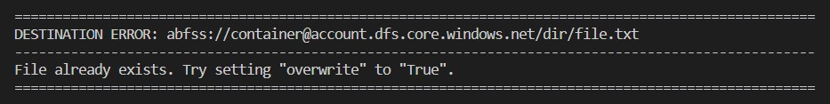

.. _ug_storage:

***********************
Interacting with data
***********************

Fluke makes it easy to inspect your data, but more imporantly,
to transfer them from one location to another, no matter where
they currently reside or to where they are being transfered.
In this section, we will look at all aspects of working with
data through Fluke.

========================================
Acquiring access to data
========================================

Fluke offers two distinct APIs in order to interact with data:

#. **File API**: Used for handling either individual files in a file system,
   be it local or remote, or objects in the cloud. This API includes:
   
     * `LocalFile <../documentation/storage.html#fluke.storage.LocalFile>`_
     * `RemoteFile <../documentation/storage.html#fluke.storage.RemoteFile>`_
     * `AWSS3File <../documentation/storage.html#fluke.storage.AWSS3File>`_
     * `AzureBlobFile <../documentation/storage.html#fluke.storage.AzureBlobFile>`_

#. **Dir API**: Used for handling entire directories of files/objects. This API includes:

     * `LocalDir <../documentation/storage.html#fluke.storage.LocalDir>`_
     * `RemoteDir <../documentation/storage.html#fluke.storage.RemoteDir>`_
     * `AWSS3Dir <../documentation/storage.html#fluke.storage.AWSS3Dir>`_
     * `AzureBlobDir <../documentation/storage.html#fluke.storage.AzureBlobDir>`_

----------------------------------------
Accessing local entities
----------------------------------------

No matter the type of entity with which you wish to interact, you need to know
its path within the storage system in which it resides. Regarding local entities,
this is actually the only piece of information required in order to access them:

.. code-block:: python

  from fluke.storage import LocalFile

  file = LocalFile(path='/home/user/path/to/file.txt')

----------------------------------------
Accessing remote entities
----------------------------------------

For any entity that is not local to our machine's file system, we usually
need a bit more information. This is typically an *Auth* instance used
for authenticating with the remote host in order to gain access to its resources
(see `Handling authentication <authentication.html>`_), as well as some
more information regarding an entity's exact location. For example, in the
case of an Amazon S3 object we also need the name of the bucket that contains
it:

.. code-block:: python

  from fluke.auth import AWSAuth
  from fluke.storage import AWSS3File

  # Create an "AWSAuth" instance.
  auth = AWSAuth(**credentials)

  # Gain access to an S3 object.
  s3_obj = AWSS3File(
    auth=auth,
    bucket='bucket_name',
    path='path/within/amazon/s3/bucket/obj.txt')

  # Close any open connections.
  s3_obj.close()

Notice how at the end we invoked the instance's ``close`` method? This is
done in order to prevent any connection leaks from occurring, and is in fact
required when interacting with any non-local entity. Alternatively, you can
avoid having to invoke this method by instantiating your object through the
class's context manager:

.. code-block:: python

  from fluke.auth import AWSAuth
  from fluke.storage import AWSS3File

  # Create an "AWSAuth" instance.
  auth = AWSAuth(**credentials)

  # Gain access to an S3 object through a context manager.
  with AWSS3File(
    auth=auth,
    bucket='bucket_name',
    path='path/within/amazon/s3/bucket/obj.txt'
  ) as s3_obj:

    # Interact with s3_obj...

========================================
Inspecting data
========================================

After having gained access to an entity, you are then
free to interact with it in various ways, like for example
fetch its size in bytes:

.. code-block:: python

  from fluke.storage import LocalFile

  file = LocalFile(path='/home/user/path/to/file.txt')
  size = file.get_size()

Since all *File* API methods are pretty self-explanatory, in this section
we will focus on the *Dir* API, and more specifically, on parameter
``recursively``, as its value directly determines the result of most
of its methods. In essence, this parameter dictates whether a directory
is going to be traversed recursively or not, or in other words, whether
we are going to take into consideration its top-level files only, or all
its files, no matter whether they reside directly within the directory or
within one of its subdirectories.

Consider for example the following directory:

.. code-block::

  dir/
  |___file1.txt
  |___subdir/
      |___file2.txt
      |___file3.txt

Now consider the following code and try to guess what will be
printed onto the console after executing it:

.. code-block:: python

    from fluke.storage import LocalDir

    dir = LocalDir(path='dir/')

    print(f"Ordinary count: {dir.count()}")
    print(f"Recursive count: {dir.count(recursively=True)}")

This is the output we get after executing the above code block:

.. code-block::

  Ordinary count: 2
  Recursive count: 3

That is because when ``recursively`` has been set to its default value,
namely the value ``False``, the ``count`` method will only consider those
entities that reside within the directory's top-level, which in our case
are the file ``file1.txt`` and the directory ``subdir``. On the other hand, when
``recursively`` has been set to ``True``, all existing subdirectories
will be traversed as well for any files they may contain, resulting in
counting three separate entities within the context of our example, namely
``file1.txt``, ``file2.txt`` and ``file3.txt``. 

Note that whenever ``recursively`` is set to ``True``,
subdirectories are not considered to be additional entities,
and are only searched for any files that may or reside within them.
If, for example, ``subdir`` were empty, then ``dir.count(recursively=True)``
would merely return the value ``1``.

========================================
Moving data between locations
========================================

The ability to transfer data between various locations is arguably
Fluke's predominant feature, and is rendered possible through
the use of the ``transfer_to`` method, which is part of both
*File* and *Dir* APIs. Below is a complete example in which we
transfer the contents of a virtual directory residing within an
Azure S3 bucket to a virtual directory of an Azure blob container,
all in just a few lines of code:

.. code-block:: python

  from fluke.auth import AWSAuth, AzureAuth
  from fluke.storage import AWSS3Dir, AzureBlobDir

  # This object will be used to authenticate with AWS.
  aws_auth = AWSAuth(**aws_credentials)

  # This object will be used to authenticate with Azure.
  azr_auth = AzureAuth(**azr_credentials)

  with (
      AWSS3Dir(auth=aws_auth, bucket="bucket", path='dir/') as aws_dir,
      AzureBlobDir(auth=azr_auth, container="container", path='dir/') as azr_dir
  ):
      aws_dir.transfer_to(dst=azr_dir, recursively=True)

This is what you should be seeing during the method's execution, provided
that you have not set parameter ``show_progress`` to ``False``:

Finally, it is important to note that if anything goes wrong during
the transfer of one or more entities, then an appropriate message
will be displayed after the method is done with being executed:

In the above case, this error could be eliminated by setting the
``transfer_to`` method's ``overwrite`` parameter to ``True``.

========================================
Managing metadata
========================================

You might have noticed that both *File* and *Dir* APIs offer a ``get_metadata/set_metadata``
method pair. Although these methods serve no purpose when transfering data to either the local
or a remote file system, as standard file systems have no way of associating files with custom
metadata, they are quite important when uploading files to the cloud in case you wish to assign
any metadata to them.

--------------------------------------------
Assigning metadata to files
--------------------------------------------

Consider the following example in which we set parameter ``include_metadata``
to ``True`` while transfering a file to Amazon S3, after we have first assigned
some metadata to it through the ``set_metadata`` method:

.. code-block:: python

  from fluke.auth import AWSAuth
  from fluke.storage import LocalFile, AWSS3Dir

  # Instantiate a local file and assign some metadata to it.
  file = LocalFile(path='/home/user/path/to/file.txt')
  file.set_metadata({'id': '12345', 'type': 'txt'})

  # Transfer file to Amazon S3 along with its metadata.
  with AWSS3Dir(auth=AWSAuth(**aws_credentials), bucket="bucket", path='dir/') as aws_dir:
      file.transfer_to(dst=aws_dir, include_metadata=True)

Along with *file.txt* being uploaded to Amazon S3, any metadata that
were defined via the ``set_metadata`` method will be associated with it.
In fact, we can easily confirm this by executing the following code:

.. code-block:: python

    print(aws_dir.get_metadata('file.txt'))

which results in the following output being printed onto the console:

.. code-block::

    {'id': '12345', 'type': 'txt'}

--------------------------------------------
Loading metadata
--------------------------------------------

It would make sense to assume that if we were to access *file.txt*
on Amazon S3 by using Fluke's *File* API, we could then invoke
``get_metadata`` so that we fetch the metadata that we previously
assigned to it. Let's do just that and see what happens:

.. code-block:: python

  from fluke.auth import AWSAuth
  from fluke.storage import AWSS3File

  # Gain access to 'file.txt' on Amazon S3 and print its metadata.
  with AWSS3File(auth=AWSAuth(**aws_credentials), bucket="bucket", path='dir/file.txt') as aws_obj:
      print(aws_obj.get_metadata())

By executing the above code, we get the following output:

.. code-block::

    None

That's strange. Shouldn't we see a dictionary containing the metadata we just assigned to
the object while transfering it to Amazon S3? Actually, the answer is no, and the reason
for this is quite simple: both methods ``get_metadata`` and ``set_metadata`` only interact
with the instance through which they are being invoked, which is no more than an object stored
within our machine's local RAM. This consequently means that if we were to invoke an instance's
``set_metadata`` method in order to assign some metadata to it, it would have absolutely no effect
on the actual metadata of the instance's underlying object entity that is stored on Amazon S3.
Similarly, invoking an instance's ``get_metadata`` method won't fetch the object's actual metadata,
though it will look for any metadata we may have assigned to it locally.

So how can we inspect the actual metadata of an object? This can be easily done
by invoking an instance's ``load_metadata`` method, which goes on to fetch
the object's actual metadata via HTTP and store them locally. Thus, going back to our
example, we would be able to display the object's true metadata if we would just
add the aforementioned line of code:

.. code-block:: python

  from fluke.auth import AWSAuth
  from fluke.storage import AWSS3File

  # Gain access to 'file.txt' on Amazon S3 and print its metadata.
  with AWSS3File(auth=AWSAuth(**aws_credentials), bucket="bucket", path='dir/file.txt') as aws_obj:
      # Load metadata first.
      aws_obj.load_metadata()
      # Then print it.
      print(aws_obj.get_metadata())

By executing the above code, we now get the expected output:

.. code-block::

    {'id': '12345', 'type': 'txt'}

As a final note, whenever setting ``include_metadata`` to ``True``, ``transfer_to`` will
always look first for any local metadata that can be assigned to the file(s) resulting from
the transfer. Nevertheless, if no metadata have been assigned to a file through
``set_metadata``, then ``transfer_to`` will actually go on to fetch any potentially
existing metadata associated with the file so that it may assign them to the resulting file.
This means that in the following example, any actual metadata associated with *file.txt*
will actually be carried over from Amazon S3 to Azure despite the fact that ``load_metadata``
has not been invoked:

.. code-block:: python

  from fluke.auth import AWSAuth, AzureAuth
  from fluke.storage import AWSS3File, AzureBlobFile

  with (
      AWSS3File(auth=AWSAuth(**aws_credentials), bucket="bucket", path='dir/file.txt') as aws_obj,
      AzureBlobDir(auth=AzureAuth(**azr_credentials), container="container", path='file.txt') as azr_blob
  ):
      aws_obj.transfer_to(dst=azr_blob, include_metadata=True)

========================================
Speeding things up with caching
========================================

Whenever you request some piece of information about a remote entity,
what happens under the hood is that Fluke will use an open connection
to the resource which possesses said information in order to transfer
it to our local machine so that you are able to access it. However,
fetching certain types of information can be quite time-consuming.
Consider for instance requesting the size of a virtual directory on
the cloud. In order to compute this value, Fluke must not only list
all individual files within the directory, but also fetch their
respective sizes so that it computes the total size of the directory.
As directories grow larger and larger, tasks like this require more
and more time to complete.

Due to the above stated reasons, Fluke offers the ability to cache
certain bits of information about remote entities after you've requested
them once, so that accessing them a second time doesn't take nearly as long
as it did the first time. You can declare a remote entity as cacheable by
setting parameter ``cache`` to ``True`` during its instantiation:

.. code-block:: python

  import time
  
  from fluke.auth import AWSAuth
  from fluke.storage import AWSS3File

  auth = AWSAuth(**aws_credentials)

  with AWSS3Dir(auth=auth, bucket="bucket", path='dir/', cache=True) as aws_dir:
      # Fetch metadata via HTTP.
      t = time.time()
      aws_dir.load_metadata()
      print(f"Fetched metadata in {time.time() - t:.2f} seconds!")

      # Fetch metadata from cache.
      t = time.time()
      aws_dir.load_metadata()
      print(f"Fetched metadata in {time.time() - t:.2f} seconds!")

Executing the above code block outputs the following:

.. code-block::

    Fetched metadata in 7.91 seconds!
    Fetched metadata in 0.01 seconds!

Note, however, that after caching an entity you are going to
be missing on any potential updates it receives, as any information
relating to it would be retrieved straight from the cache.
Be that as it may, you can always clear an instance's cache
by invoking ``purge``:

.. code-block:: python
  
  from fluke.auth import AWSAuth
  from fluke.storage import AWSS3File

  with AWSS3Dir(auth=AWSAuth(**aws_credentials), bucket="bucket", path='dir/', cache=True) as aws_dir:
      # Count number of items in directory.
      print(f"Directory count: {aws_dir.count()}")

      # At this point, one more file
      # is uploaded onto the directory.

      # Re-count number of items in directory
      # without purging the cache.
      print(f"Directory count: {aws_dir.count()}")

      # Re-count number of items in directory
      # after purging the cache.
      aws_dir.purge()
      print(f"Directory count: {aws_dir.count()}")

By executing the above code, we get the following output:

.. code-block::

    Directory count: 1
    Directory count: 1
    Directory count: 2

